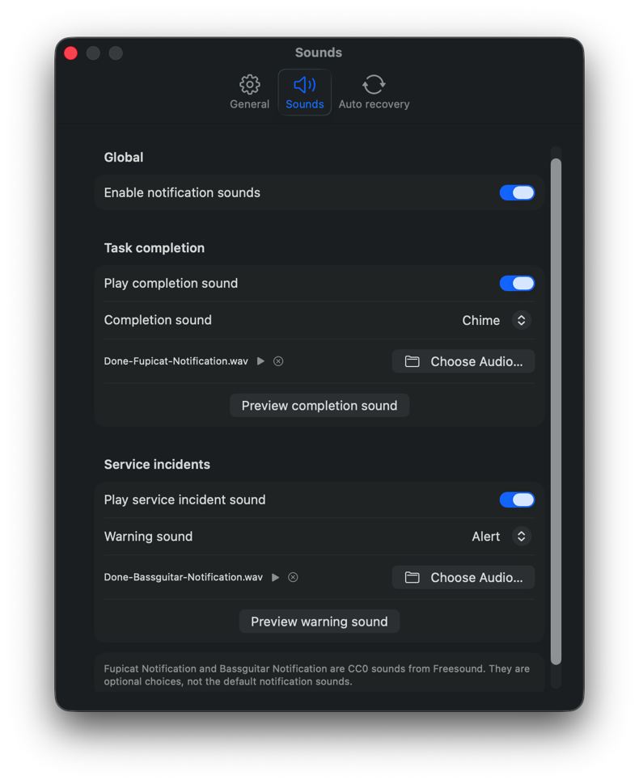
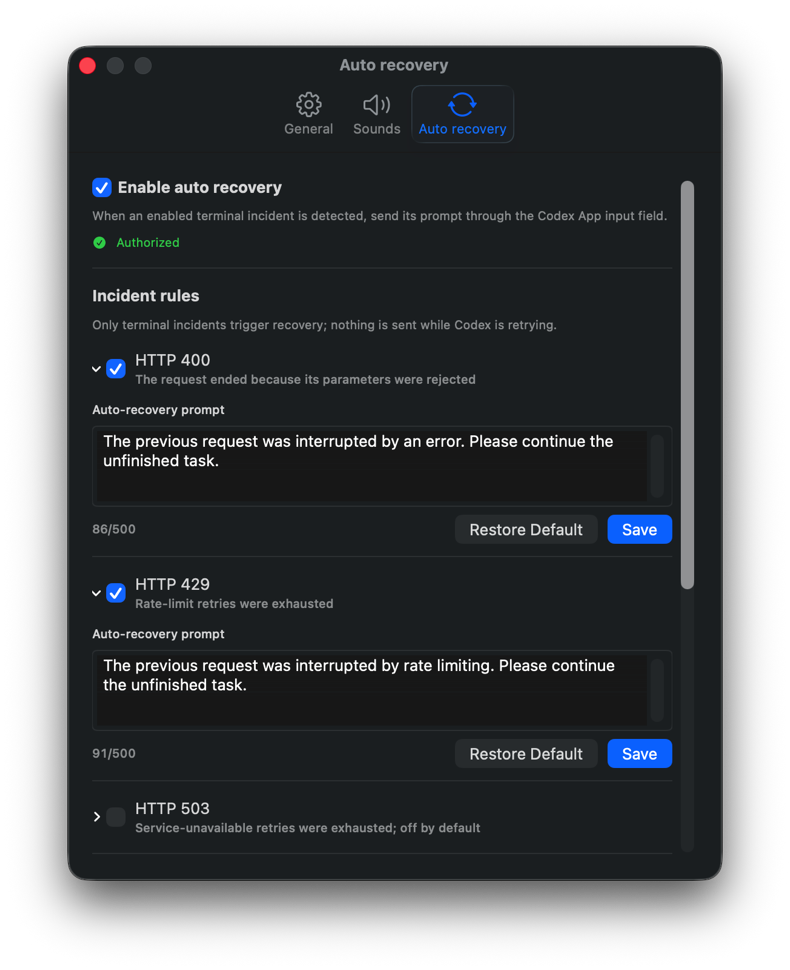

# ThreadBeacon for Codex

[简体中文](README.md) | English

[](https://github.com/ExDevilLee/codex-threadbeacon-macos/releases)

[](LICENSE)

ThreadBeacon is a native macOS status window for monitoring primary Codex Desktop and Codex CLI
tasks at a glance. It reduces repeated context switching while several tasks are running and works
well pinned on the desktop or placed on a dedicated portrait display.

This is an unofficial community project. It is not affiliated with or endorsed by OpenAI.
`Codex` is a trademark of its respective owner.

## A Dedicated Small-Screen Status Board

ThreadBeacon's compact list fits a portrait secondary display, including a 7-inch screen. Keep
Codex interactions on the MacBook, code and diffs on the main monitor, and task states continuously
visible on the small display.


> AI-generated workspace concept. On-screen content illustrates the layout and workflow; refer to
> the screenshots below for the actual app UI.

## 30-Second Quick Start

Before starting, make sure that:

- You are running macOS 14 or later on an Apple Silicon or Intel Mac.
- Codex Desktop or Codex CLI is installed and has run at least one task.
- The current download is an ad-hoc signed, unnotarized technical preview.

Install and launch:

```bash
brew install --cask ExDevilLee/tap/threadbeacon
```

ThreadBeacon automatically reads recent local Codex primary tasks. No account, API token, or data
path is required. If macOS blocks the first launch, select **Done** instead of **Move to Trash**,
then Control-click `ThreadBeacon.app` in Finder's **Applications** folder and select **Open**. See
[`Troubleshooting`](docs/troubleshooting-en.md#macos-blocks-the-app) for the complete steps.

## Interface Preview

| Primary task status | Inline Subagent expansion |
| :---: | :---: |
|  |  |

| Token usage details | General Settings |
| :---: | :---: |
|  |  |

| Notification and custom sounds | Auto-recovery rules and successful delivery |
| :---: | :---: |
|  |  |

## Core Features

### Glanceable Task States

- Refreshes every 2 seconds by default, with `1 / 2 / 5 / 10 seconds`, pause, and manual refresh
  options.
- Shows the latest renamed task title, status duration, and running-task count.
- Distinguishes running, just completed, interrupted, service incident, and unknown states.
  Color-blind-safe symbols are enabled by default. Token details show the cumulative compaction
  count; live compacting status requires an opt-in Codex Hook installed from Settings.
- The just-completed state can remain visible for `1-5 minutes`; status priority always outranks
  manual pinning.
- The window can stay above other apps and restores its display, position, and size.

### Subagent And Token Overview

- Primary tasks show direct Subagents as `active/total`, such as `2/27`, with inline expansion.
- Expanded rows show agent alias, task name, state, recent activity, model, reasoning effort, and
  Token usage.
- The main list keeps cumulative Token usage compact; the info view adds input, cached input,
  output, reasoning, current-turn usage, cache ratio, model, and reasoning effort.
- Token details never display conversation bodies or aggregate second-level and deeper Subagents.
- See the Chinese [`compaction observability design`](docs/compaction-observability-design.md) for
  history, Hook installation, and privacy boundaries.

### Incident Monitoring And Sounds

- Reads allowlisted local structured logs for HTTP 4xx/5xx retries and terminal failures,
  exhausted reconnection failures, and explicit model-capacity incidents.
- Active retries appear as warnings and terminal incidents as errors. A generic completion event
  cannot override a confirmed failure.
- Completion and incident notifications use separate default sounds. Either can be disabled, use
  one of eight built-in sounds, or select a local audio file.
- See [`THIRD_PARTY_NOTICES.md`](THIRD_PARTY_NOTICES.md) for sound sources and licenses.
- See the Chinese [`service incident monitoring`](docs/service-incident-monitoring.md) document for
  detailed state and data-source rules.

### Optional Auto Recovery

- Auto recovery is off by default. HTTP 400, HTTP 429, HTTP 503, other HTTP failures,
  model-capacity incidents, and connection interruptions have separate rules and prompts; HTTP 503
  remains off by default.
- Sending requires explicit macOS Accessibility permission and uses the visible Codex App input
  field. Without permission, ThreadBeacon remains read-only and never attempts an invisible CLI
  resume.
- Each incident type defaults to 3 consecutive attempts. Settings accepts `1-20` or unlimited
  attempts. A normal completion resets the count, and an individual open circuit can be cleared.
- Local recovery records distinguish not sent, sending, sent, failed, and circuit-open results.

### Everyday Controls And Settings

- Favorite, show only favorites, pin, temporarily ignore, and restore tasks. Archived favorites
  remain visible with an explicit archived state.
- Double-click an unarchived primary task to open it in Codex App after Accessibility, identity,
  and draft-safety checks.
- Settings supports Follow System, Simplified Chinese, and English, plus System, Light, and Dark
  themes.
- Configure visible task count, refresh interval, completion retention, sounds, auto recovery, and
  launch at login.
- A compact health control reports SQLite, Rename, Rollout, and service-log data-source status.
- The app checks GitHub Releases and shows an update link without downloading or installing it.

## Download And Install

### Homebrew Cask

```bash
brew install --cask ExDevilLee/tap/threadbeacon
```

Upgrade to the newest version in the tap:

```bash
brew update
brew upgrade --cask threadbeacon
```

A regular uninstall preserves settings. To also remove preferences and auto-recovery logs:

```bash
brew uninstall --zap --cask threadbeacon
```

The cask source and CI are in
[`ExDevilLee/homebrew-tap`](https://github.com/ExDevilLee/homebrew-tap). Homebrew downloads,
verifies, and installs the app, but it does not bypass Gatekeeper.

### GitHub Release

Download both files from
[GitHub Releases](https://github.com/ExDevilLee/codex-threadbeacon-macos/releases):

```text
ThreadBeacon-vX.Y.Z-macos-universal.zip
ThreadBeacon-vX.Y.Z-macos-universal.zip.sha256
```

With both files in the same directory, verify the archive:

```bash
shasum -a 256 -c ThreadBeacon-vX.Y.Z-macos-universal.zip.sha256
```

Extract the ZIP and move `ThreadBeacon.app` to `/Applications`. The current build does not yet use
a Developer ID Application signature or Apple notarization, so the first-launch steps match the
Homebrew instructions above. Do not disable system-wide security protections.

## Data And Privacy

- The app reads only local task SQLite, rename index, rollout tails, and three allowlisted log
  targets under `~/.codex` to derive states, Tokens, model details, and incidents.
- It does not read reasoning summaries, conversation bodies, full requests, provider URLs, or
  request IDs. It does not upload Codex data or start a network service.
- Auto recovery is off by default. The app controls the Codex input field only after the user grants
  Accessibility permission and enables a matching rule.
- The app does not directly modify Codex SQLite. Experimental archive restore is not exposed in the
  public UI.
- Live compaction state is optional. Only explicit user opt-in allows a structured update to the
  local Codex Hook configuration; unrelated hooks are preserved and Settings can remove it.
- Update checks request only public GitHub Release metadata and include no Codex data, local paths,
  settings, or device identifier.
- See [`PRIVACY.md`](PRIVACY.md) for local persistence, recovery logs, and permission details.

## Known Limitations

- An unresolved task with no recent rollout events may temporarily appear as unknown even while a
  quiet tool call is still running.
- Read-only sources cannot reliably distinguish approval waiting from user-input waiting. The app
  does not infer these states from silence or conversation text.
- Codex SQLite, session index, rollout, and log formats are not stable public APIs and may require
  adaptation after Codex updates.
- The current technical preview is not notarized. Launch at login depends on a stably signed app
  bundle and is therefore not guaranteed.

See [`Troubleshooting`](docs/troubleshooting-en.md) for explanations and recovery steps.

## Development And Feedback

Build locally:

```bash
./script/test.sh
./script/build_and_run.sh --verify
```

- Changes: [`CHANGELOG.md`](CHANGELOG.md)
- Future candidates: [`ROADMAP.md`](ROADMAP.md)
- Contributing: [`CONTRIBUTING.md`](CONTRIBUTING.md)
- Ordinary reports: use GitHub Issue Forms and never upload task titles, conversations, databases,
  or local paths.
- Security reports: see [`SECURITY.md`](SECURITY.md).

## App Icon


The `B1 Graphite / Code Beacon` icon uses a graphite tile, white code braces, and vertically stacked
red, amber, and green lights.

## Platform Repositories

- macOS: [`ExDevilLee/codex-threadbeacon-macos`](https://github.com/ExDevilLee/codex-threadbeacon-macos)
- Windows: [`ExDevilLee/codex-threadbeacon-windows`](https://github.com/ExDevilLee/codex-threadbeacon-windows)

Each platform has an independent repository, implementation, and release process. They share state
semantics, feature contracts, and test scenarios without a source dependency.
