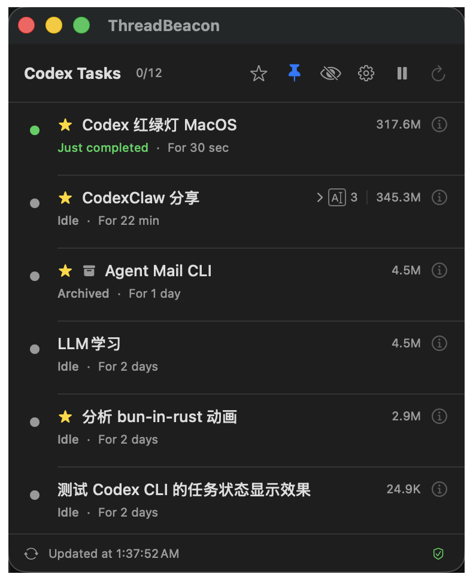
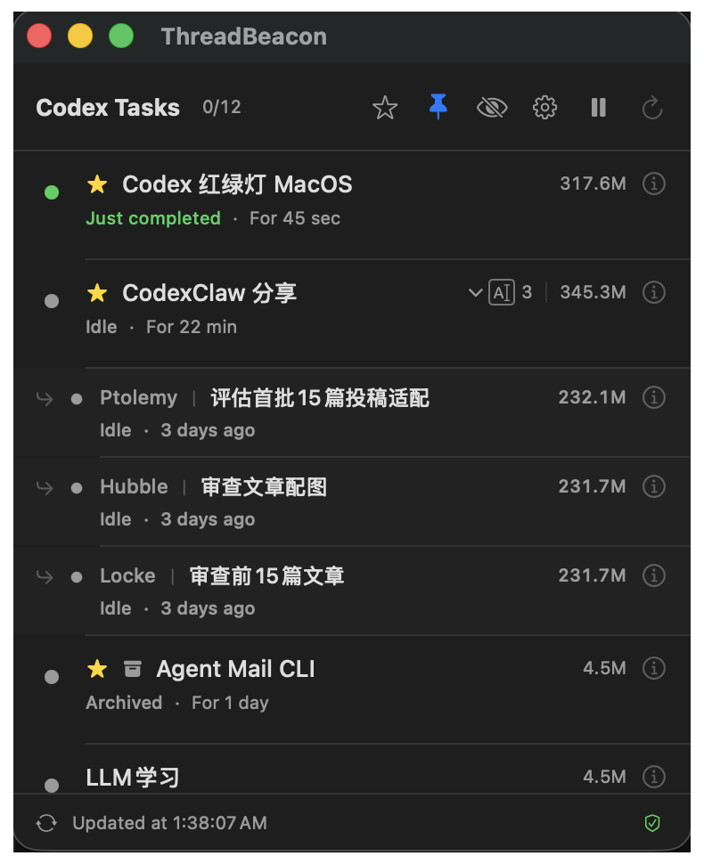
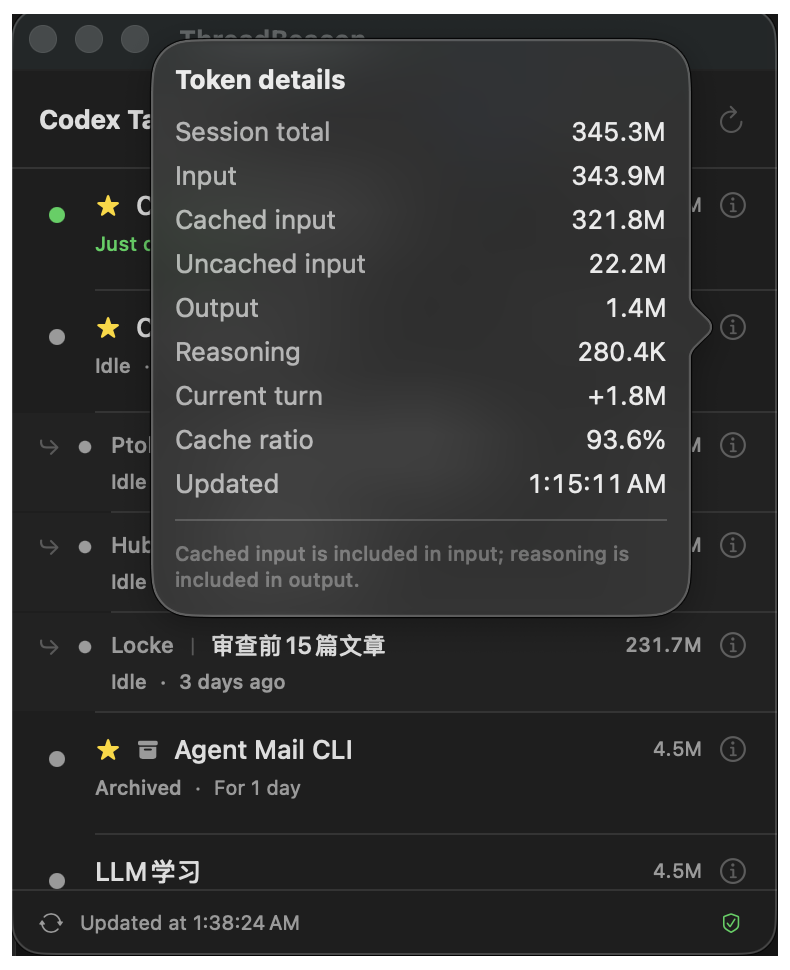
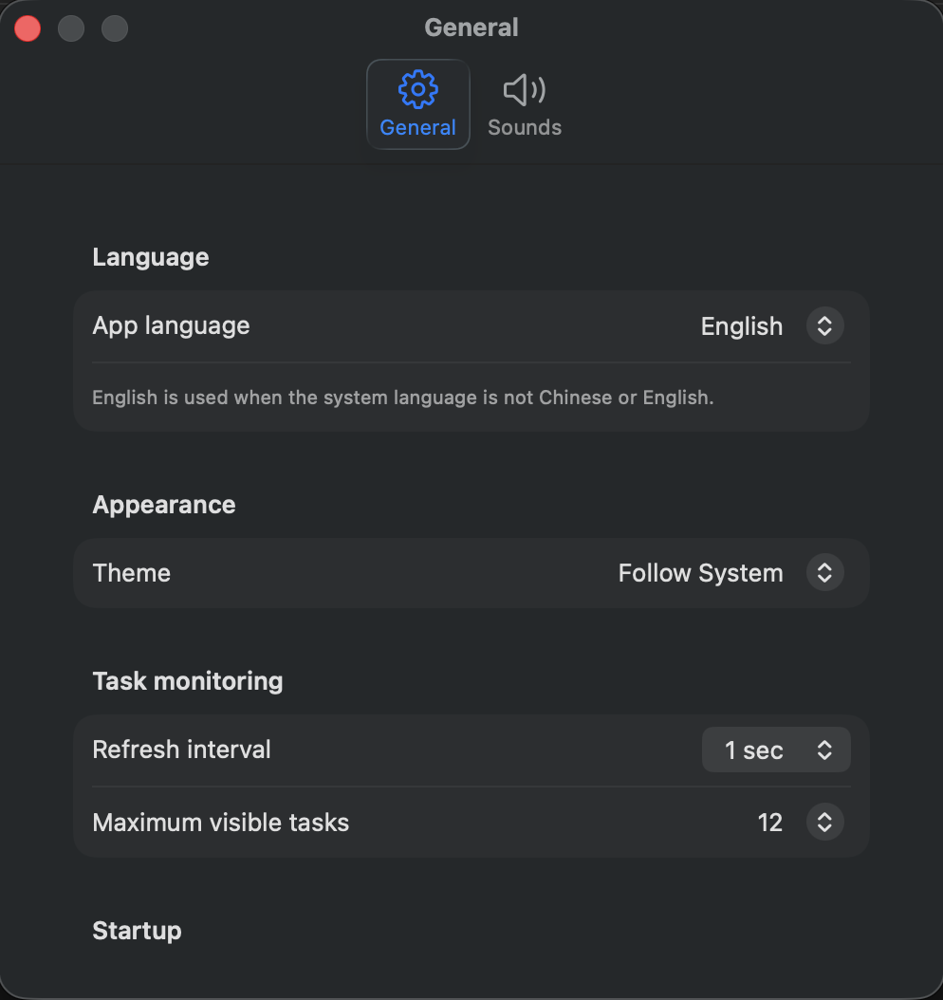
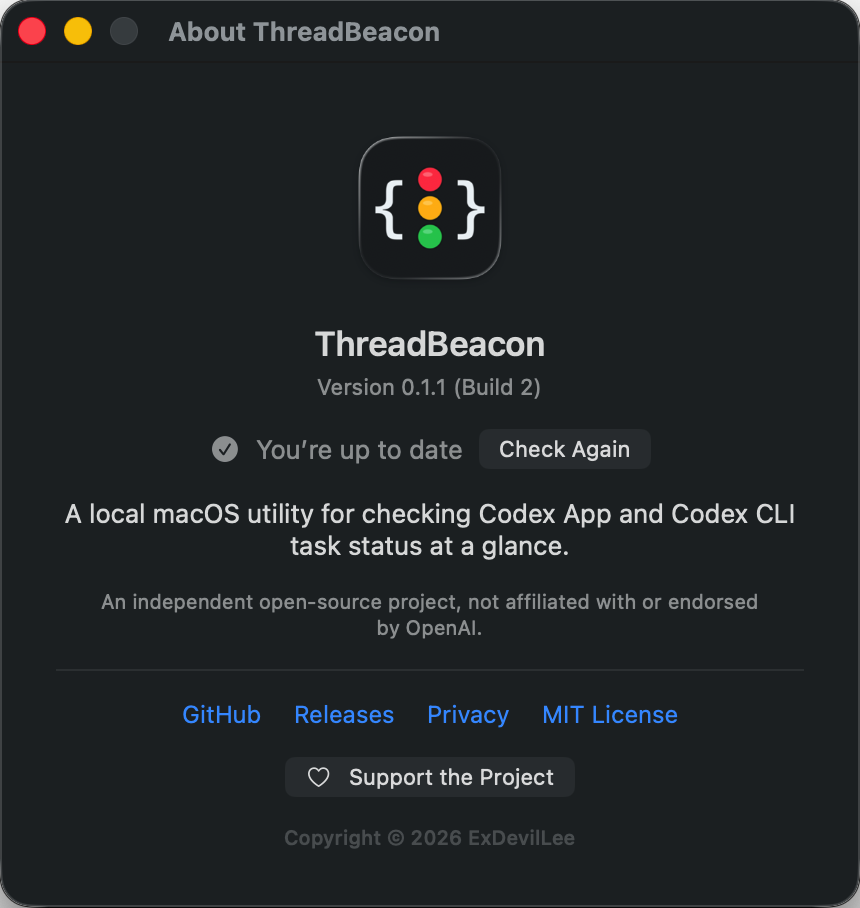

# ThreadBeacon for Codex

[简体中文](README.md) | English

[](https://github.com/ExDevilLee/codex-threadbeacon-macos/releases)

[](LICENSE)

## Purpose

ThreadBeacon is a native macOS status window for monitoring primary Codex Desktop
and Codex CLI tasks at a glance. The first version tests whether a glanceable status
view reduces the need to repeatedly switch back to Codex. USB displays and Codex
controls are outside the current scope. The current sound feature only covers reliably
detected primary-task completion events, explicit HTTP 4xx/5xx failures (except HTTP 503),
retries or terminal failures, and selected-model capacity failures found in local structured logs. Approval waiting
still has no reliable read-only data source.
Auto recovery is off by default. Settings provides separate rules and editable prompts
for HTTP 400, HTTP 429, HTTP 503, other HTTP failures, and model-capacity failures.
Only terminal incidents trigger recovery, and HTTP 503 remains off by default. Sending
requires explicit macOS Accessibility permission and uses the visible Codex App input
field; ThreadBeacon never falls back to an external Codex CLI resume. Historical
incidents found at startup are not replayed, and monitoring continues.

This is an unofficial community project. It is not affiliated with or endorsed by OpenAI. `Codex` is a trademark of its respective owner.

## 30-Second Quick Start

Before starting, make sure that:

- You are running macOS 14 or later on an Apple Silicon or Intel Mac.
- Codex Desktop or Codex CLI is installed and has run at least one task.
- The current download is an ad-hoc signed, unnotarized technical preview.

Then:

1. Download `ThreadBeacon-vX.Y.Z-macos-universal.zip` from
   [Releases](https://github.com/ExDevilLee/codex-threadbeacon-macos/releases).
2. Extract it and move `ThreadBeacon.app` to `/Applications`.
3. If macOS blocks the first launch, Control-click the app in Finder and select **Open**.
4. ThreadBeacon automatically reads recent local Codex primary tasks. No account, API token,
   or data path is required.

If no tasks appear or the footer reports a data-source problem, see
[`Troubleshooting`](docs/troubleshooting-en.md) before opening a privacy-safe Issue.

## Interface Preview

| Primary task status | Inline Subagent expansion |
| :---: | :---: |
|  |  |

| Token usage details | General Settings |
| :---: | :---: |
|  |  |

### Update Check



See [`ROADMAP.md`](ROADMAP.md) for planned features and their proposed validation order.

See the Chinese
[`prior-art review`](docs/prior-art-review.md) for related GitHub projects,
implementation differences, naming risks, and feature candidates.

See the Chinese
[`app-server integration POC`](docs/app-server-integration-poc.md) for evidence about
why an independent app-server cannot currently observe Codex Desktop runtime events.

See the Chinese
[`service incident monitoring design`](docs/service-incident-monitoring.md) for the
service-incident data source, state rules, and privacy boundary.

See the Chinese
[`Codex CLI compatibility POC`](docs/codex-cli-compatibility.md) for the verified data
path and the remaining compatibility boundaries.

## Download And Install

Open [GitHub Releases](https://github.com/ExDevilLee/codex-threadbeacon-macos/releases)
and download both files for the selected version:

```text
ThreadBeacon-vX.Y.Z-macos-universal.zip
ThreadBeacon-vX.Y.Z-macos-universal.zip.sha256
```

With both files in the same directory, optionally verify the download:

```bash
shasum -a 256 -c ThreadBeacon-vX.Y.Z-macos-universal.zip.sha256
```

Extract the ZIP, move `ThreadBeacon.app` to `/Applications`, and open it. The current
technical preview uses an ad-hoc signature and is not notarized by Apple. If macOS blocks
the first launch, Control-click the app in Finder, select **Open**, and confirm the source,
or follow the matching prompt in **System Settings > Privacy & Security**. Do not disable
system-wide security protections.

Launch at login is not guaranteed for the current preview package. It will be verified again
after Developer ID Application signing and notarization are available. See
[`CHANGELOG.md`](CHANGELOG.md) for version changes and
[`Troubleshooting`](docs/troubleshooting-en.md) for common problems.

## Run From Source

From the project directory:

```bash
./script/build_and_run.sh --verify
```

The script builds and launches:

```text
dist/ThreadBeacon.app
```

The script uses the repository's `ThreadBeacon.xcodeproj` to build a real macOS
application target. `Package.swift` remains the Core test and command-line probe path.
The default build is ad hoc signed. If an Apple Development identity is available,
provide the local Team ID temporarily:

```bash
THREADBEACON_DEVELOPMENT_TEAM=<YOUR_TEAM_ID> \
  ./script/build_and_run.sh --verify
```

The Team ID is not stored in project files or Git history. Apple Development is for
local development builds and does not replace the Developer ID Application signature
and notarization required for public distribution.

Additional verification commands:

```bash
./script/test.sh
./script/probe.sh
```

`probe.sh` prints only the task count and status totals. It does not print task titles or conversation content.

## App Icon

The icon uses the `B1 Graphite / Code Beacon` design: a graphite rounded tile, white braces, and vertically stacked red, amber, and green lights. Assets:

- `Resources/AppIcon-1024.png`: 1024px PNG master.
- `Resources/AppIcon.icns`: standard macOS app icon.

The icon is rendered deterministically with AppKit and can be regenerated locally:

```bash
./script/generate_app_icon.sh
```

The Xcode application target copies the `.icns` file into the app bundle and writes `CFBundleIconFile`. Verify it separately with:

```bash
./script/verify_app_icon.sh
```

## Sound Assets

Eight sounds are built in. Beacon, Chime, Pulse, Alert, Resolve, and Knock are generated
deterministically by project scripts. The other two are CC0 sounds from Freesound and are
optional custom choices, not defaults. Completion defaults to Chime, while service incidents
default to Alert. Either notification can use any of the eight sounds or a separate local audio file. See
[`THIRD_PARTY_NOTICES.md`](THIRD_PARTY_NOTICES.md) for sources and licenses. Regenerate the
project-created sounds and verify all assets with:

```bash
./script/generate_sound_assets.sh
./script/verify_sound_assets.sh
```

## Interface

- Shows the 8 most recent unarchived primary Codex Desktop and Codex CLI tasks by
  default; Settings can change the limit to `4 / 8 / 12 / 20`. Subagent threads are
  excluded, while archived favorites remain available in the favorites filter.
- UI language supports `Follow System`, `Simplified Chinese`, and `English`. When following the
  system, unsupported languages fall back to English; more languages are planned.
- Each row shows a status light, localized status label, task title, and status duration.
- A primary task that created Subagents shows its direct Subagent count beside the title. This is
  a historical relationship count, not a live running count.
- Click the Subagent count to expand direct children inline. Each row shows
  `agent alias | title`, status, recent activity, and the child's cumulative Token usage. Hover
  over or click the info icon for nickname, role, model, reasoning effort, and Token details.
  Child data is read only while expanded; conversation bodies and deeper task-tree levels are not
  displayed.
- Each row shows a compact cumulative Token total. Hover over the info icon for
  input, cached and uncached input, output, reasoning, current-turn usage, cache
  ratio, and update time; click the icon to keep the details open.
- Task titles prefer the latest renamed value in `session_index.jsonl`, with `threads.title` as fallback.
- The current version does not read or display conversation summaries or message bodies.
- Refreshes every 2 seconds by default. Settings can select `1 / 2 / 5 / 10 seconds`,
  with changes applied immediately; manual refresh remains available.
- The toolbar can pause or resume automatic monitoring. Manual refresh remains
  available while paused, and monitoring resumes by default after relaunch.
- A compact data-source health control appears at the bottom right. Healthy operation stays
  unobtrusive, while degraded or unavailable sources use distinct icons, text, and color. Click it
  to inspect the task database, Rename index, Rollout, and service-log status, the latest successful
  refresh, and Rollout read success/failure counts.
- The app silently checks GitHub Releases once after launch. When a newer version exists, a download
  icon appears beside the footer health control and opens that specific Release page. About also
  provides a manual check. ThreadBeacon never downloads, installs, replaces, or restarts the app.
- The pin button keeps the window above other apps and persists the selection across launches.
- The main window remembers its latest display, position, and size across launches. If the saved
  display is unavailable or the saved frame exceeds the current visible area, the window safely
  falls back and remains visible on the main display. Runtime display hot-plug handling and an
  explicit display selector are outside this version.
- Right-click a primary task to favorite, pin, or ignore it. Favorites form a durable watchlist
  without changing sort order. The toolbar star switches between all tasks and favorites only,
  and persists that filter across launches.
- Archived favorites use a neutral `Archived` state while retaining available renamed titles and
  Token data. They never appear as running or trigger completion or incident sounds.
- The `Restore to Active` context-menu action for archived favorites is temporarily hidden. The
  underlying POC confirms that the official `codex unarchive <SESSION_ID>` command can clear the
  archive state, but the current Codex app does not reliably return an older task to the sidebar,
  and its task deep link may report that the task cannot be found. The action will be reconsidered
  when Codex provides a public interface that can reliably restore sidebar access and open the
  task. ThreadBeacon does not modify SQLite recency fields or call private Codex app IPC.
- Status priority remains above pinning, while pinned tasks lead within the same status. A normal
  ignore rule clears automatically when a newer turn starts.
- When ignored tasks exist, an `eye.slash` toolbar button can restore one task or all tasks.
- The gear button opens the native macOS Settings window. The General tab configures the
  language, theme, refresh interval, task limit, and launch at login; the Sounds tab manages completion and
  service-incident sounds. Launch at login uses Apple's `SMAppService.mainApp` and reflects the
  current macOS status rather than a simulated preference. If approval is required, the toggle
  remains on and Settings provides a shortcut to Login Items. Both sound categories can be
  disabled independently and selected from eight built-in sounds, or assigned separate local audio
  files. Missing, moved, or unsupported custom files fall back to the selected built-in sound.
  Settings persist across
  launches. Startup, manual refresh, and resumed monitoring do not replay historical events.
- Retryable 429/503 incidents appear as yellow `warning`; HTTP 400, exhausted retries, and
  selected-model capacity failures appear as red `error`. One incident episode plays at most one warning sound,
  and failures suppress a misleading completion sound.
- The auto-recovery master switch is off by default. HTTP 400, HTTP 429, other terminal
  HTTP failures, and model-capacity rules are prepared as enabled; HTTP 503 is prepared
  as disabled. Every prompt can be edited or restored, and active retries never trigger.
- Settings > Auto recovery records the session ID, incident episode, record time,
  not-sent/sending/sent/failed state, and a sanitized result. The default not-sent
  reason is that macOS Accessibility permission is required.
- Auto recovery shows the app's real Accessibility authorization state. It requests
  permission only after the user clicks Request Access and can explicitly open macOS
  Accessibility Settings. Release builds omit the manual diagnostics, task-ID field,
  and test-send controls; local Debug builds retain them for compatibility testing.
- Debug diagnostics can manually validate the current Codex
  input field. Only a unique composer that is safely classified as empty is temporarily
  populated with the fixed prompt, read back, and immediately cleared. Codex can expose
  placeholder state as a stale nonempty `AXValue`; ThreadBeacon treats it as empty only
  when the composer also contains an explicit `placeholder` static-text subtree. Real
  drafts and unreadable values still fail closed. The validation never finds a send button,
  simulates Return, or joins the automatic recovery path.
- Debug diagnostics also accept a target task ID. The app opens `codex://threads/<thread-id>` and
  verifies the renamed title in the Codex title bar. Before opening the deep link, it stops
  if the current Codex composer contains a draft, its value cannot be read, or multiple
  composers make the source ambiguous. This validation does not write or send.
- After explicit confirmation, the Debug test action can send a recovery prompt. Success
  requires a matching new message and `task_started` in the rollout belonging to the exact
  target ID. A live test with two identically named tasks succeeded before and after their
  list positions were swapped; only the requested ID changed.
- Automatic recovery uses the unattended preflight policy. It fails closed while Codex is
  frontmost, a draft exists, identity is ambiguous, or another recovery is already running.
- To make the recovery message visible in the corresponding Codex App conversation,
  ThreadBeacon must control the Codex App input field through macOS Accessibility.
  This requires a separate user-granted Accessibility permission. Without it,
  ThreadBeacon only monitors read-only data and never attempts an invisible external
  CLI resume.
- Sort priority is `error`, `needsAction`, `warning`, `running`, `justCompleted`, `idle`, then
  `unknown`.

## Data And Privacy

The app reads only local data:

- `~/.codex/state_5.sqlite`: metadata, `rollout_path`, archive state, and cumulative `tokens_used`
  for recent unarchived tasks and archived favorites,
  parent-child relationships, and nickname, role, model, and reasoning effort for expanded direct
  Subagents, opened in SQLite read-only mode.
- `~/.codex/session_index.jsonl`: the latest renamed title matching each task ID.
- Rollout JSONL: at most the final 2 MiB per task, reading only event types,
  timestamps, and numeric Token fields to derive status, usage details, and
  `task_complete` completion events.
- `~/.codex/logs_2.sqlite`: opened read-only and restricted to three allowlisted targets for
  visible tasks. Only turn IDs, HTTP status, retry progress, explicit model-capacity kind,
  and terminal failure time are extracted.

The app does not read `codex_http_client::transport` or extract reasoning summaries,
conversation bodies, full requests, provider URLs, or request IDs. It does not start a network
service or upload Codex data. Accessibility is used only after the user explicitly grants
permission. Release builds use it only when auto recovery and the matching incident rule
are enabled; Debug diagnostics remain manually triggered. The read-only result contains structural counts only;
input validation temporarily writes the fixed prompt and clears it immediately. Target-task
validation matches the ID, renamed title, and Codex title bar in memory. Neither path sends a
message or persists a task title.
After launch, the app only requests
public Release metadata from `api.github.com` to check for updates; the request contains no Codex
data, local paths, user settings, or device identifier. The current public UI does not
directly modify Codex SQLite. Auto recovery sends only the locally visible configured prompt;
it does not invoke an external Codex CLI or read or compose conversation content. The
validated archive-restore POC has no user-accessible entry
point and never writes
SQLite directly. Data-source health reports remain in memory and contain only stable categories,
counts, and the last successful refresh time. They do not retain raw errors, local paths, or task
identities and do not expand the app's read scope. See [`PRIVACY.md`](PRIVACY.md) for the full
privacy statement.

## POC Limitations

- `running` means the latest turn has no later `final` or `final_answer` event and has received a new event within 120 seconds.
- An unresolved turn with no new event for more than 120 seconds becomes `unknown`, preventing interrupted tasks from remaining falsely marked as running. A quiet long-running tool call may also temporarily appear as `unknown`.
- `justCompleted` is retained for 60 seconds, then derived as `idle`.
- Current-turn usage is calculated from two cumulative snapshots. If the rollout
  tail has no reliable baseline, the UI shows `—` instead of guessing from one call.
- Cumulative Tokens represent processing across model calls. They are not the
  current context length and are not a cost estimate.
- The current version plays one completion sound for a new `task_complete` event and one
  incident sound for a new HTTP 4xx/5xx or model-capacity episode. A later success clears a retry
  warning; a terminal failure overrides a misleading rollout `task_complete`.
- The app does not infer `error`, `warning`, or `needsAction` from silence, timeouts, or
  conversation text. Current error and warning states require allowlisted HTTP 4xx/5xx or explicit
  model-capacity log evidence; approval status is not implemented.
- Codex SQLite, session index, and rollout formats are not stable public APIs and may require adaptation after Codex updates.
- The POC is not sandboxed because it reads `~/.codex`. It is not distribution-signed or notarized,
  and update reminders do not automatically install a release.
- Launch at login requires macOS to recognize the current app bundle. The project now has a real
  Xcode macOS application target, but a build signed with this machine's free Personal Team
  Apple Development identity and installed in `/Applications` still made `SMAppService.mainApp`
  return `notFound`, so the toggle remains disabled. A stable Developer ID Application-signed
  build is still needed before registration, approval, login, and unregistration can be verified.
- The current machine has a SwiftPM Manifest/Test runtime mismatch in Command Line Tools. Project scripts work around it with a temporary, untracked `.build/swiftpm-libs/` copy. Use the provided scripts instead of relying on `swift test` directly.

## Uninstall

Stop the process and remove build artifacts:

```bash
pkill -x ThreadBeacon 2>/dev/null || true
rm -rf dist .build
```

If launch at login was previously enabled successfully, disable it in the app first or remove it
from macOS System Settings > General > Login Items & Extensions before deleting the app. The POC
does not install a separate system service or modify global configuration.

## License And Security

- Licensed under the [MIT License](LICENSE).
- Read [`CONTRIBUTING.md`](CONTRIBUTING.md) before contributing.
- Use GitHub Issue Forms for ordinary reports. Never upload task titles, conversation content,
  databases, or local paths.
- See [`SECURITY.md`](SECURITY.md) for security reporting guidance.

## Platform Repositories

ThreadBeacon keeps platform implementations in separate repositories. This
repository contains only the native macOS app; each platform is developed and
released independently.

Related projects:

- [Codex ThreadBeacon for Windows](https://github.com/ExDevilLee/codex-threadbeacon-windows)
