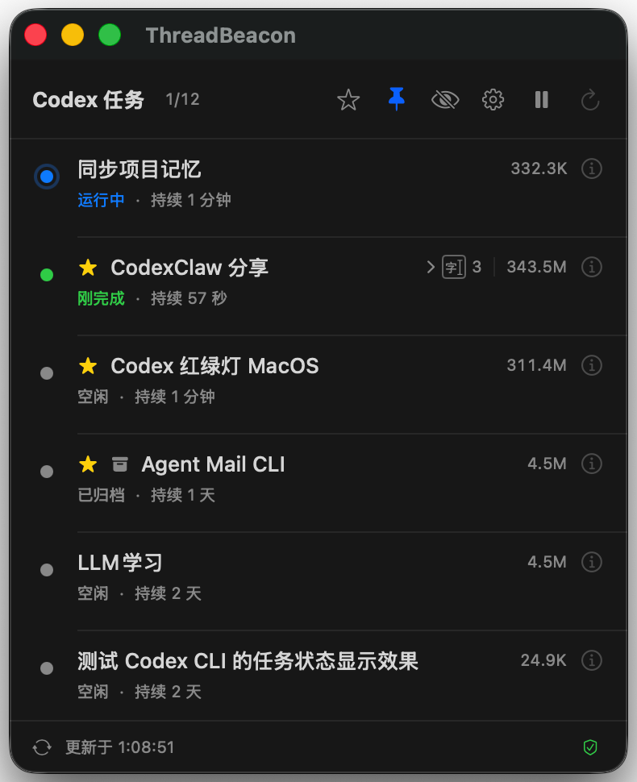
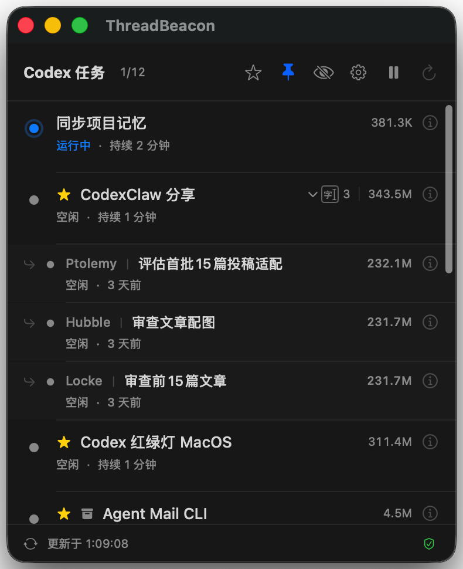
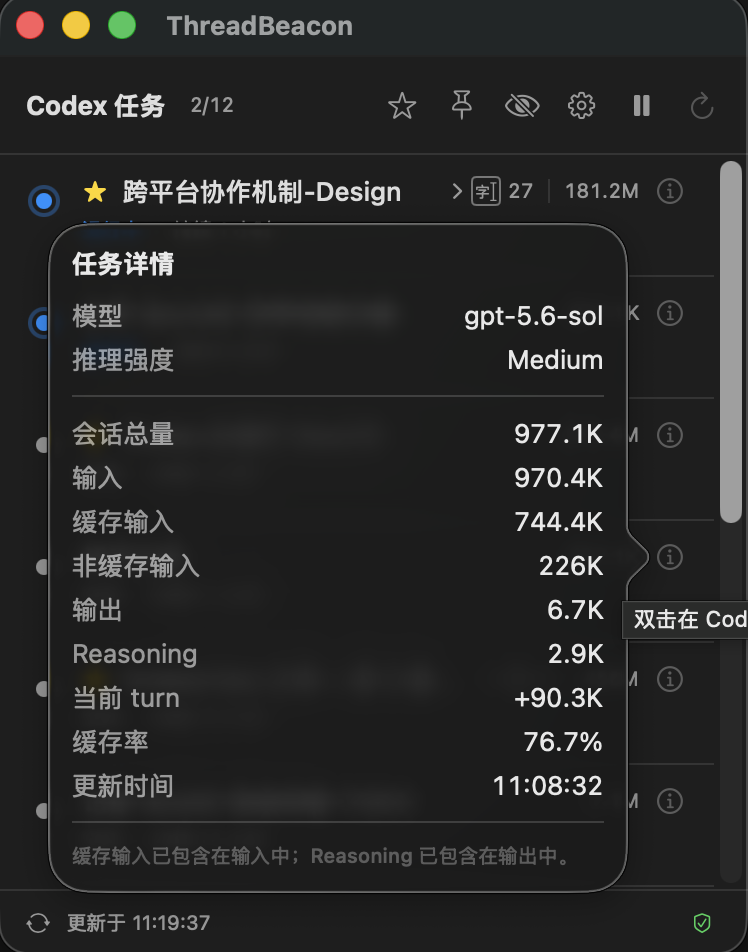
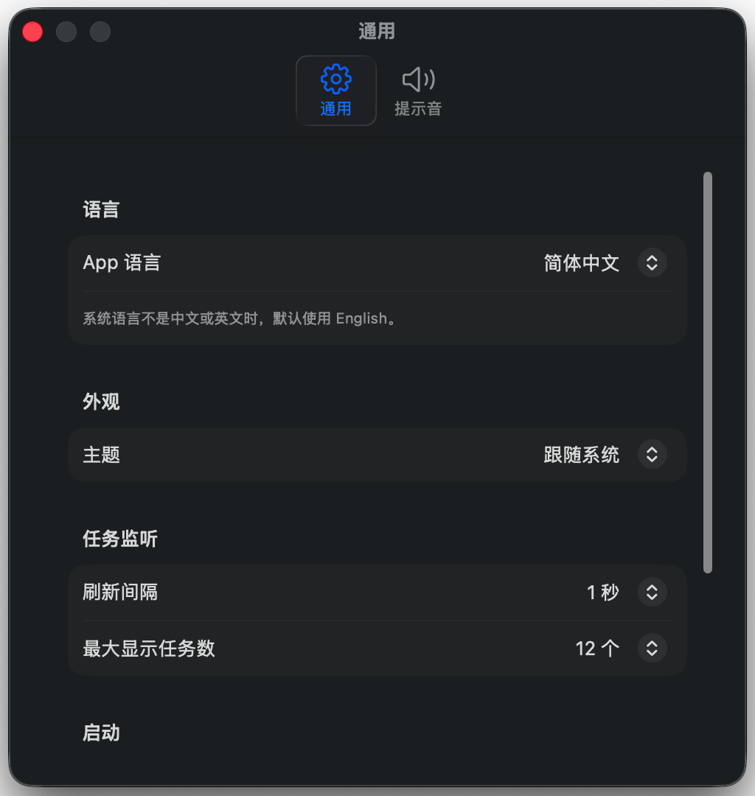
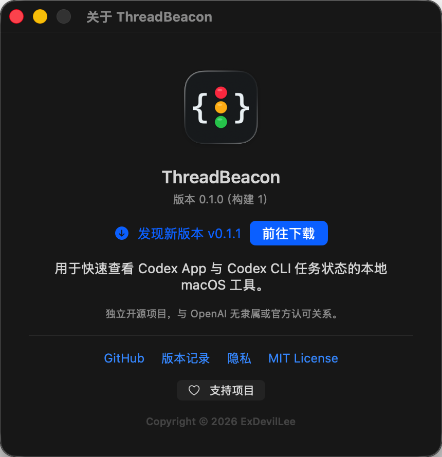

# ThreadBeacon for Codex

简体中文 | [English](README-EN.md)

[](https://github.com/ExDevilLee/codex-threadbeacon-macos/releases)

[](LICENSE)

## 目标

ThreadBeacon 是一个用于集中查看 Codex Desktop 与 Codex CLI 主任务状态的原生 macOS
小窗口。第一版验证的是“集中看状态是否比反复切回 Codex 更省注意力”，不包含 USB
小屏或 Codex 控制。
当前版本可提示可靠识别的主任务完成事件，以及本机日志中明确记录的 HTTP 400 Bad
Request、HTTP 4xx/5xx 服务重试或最终失败和所选模型容量已满；授权等待仍没有可靠的
只读数据源。
检测到新的主任务终止型 HTTP 4xx/5xx（HTTP 503 除外）或模型容量异常时，App 会自动通过本机 Codex CLI 发送
“刚才中断了，请继续未完成的任务”；启动时已有的历史异常不会补发，
发送失败也不会影响状态监听。

本项目是非官方社区工具，与 OpenAI 无隶属或背书关系。`Codex` 是其相应权利人的商标。

## 30 秒快速开始

使用前请确认：

- macOS 14 或更高版本，支持 Apple Silicon 与 Intel Mac。
- 已安装 Codex Desktop 或 Codex CLI，并且至少运行过一个任务。
- 当前下载包是 ad-hoc 签名、尚未公证的技术预览版。

操作步骤：

1. 从 [Releases](https://github.com/ExDevilLee/codex-threadbeacon-macos/releases) 下载
   `ThreadBeacon-vX.Y.Z-macos-universal.zip`。
2. 解压后把 `ThreadBeacon.app` 拖入 `/Applications`。
3. 首次启动如果被 macOS 拦截，请在 Finder 中按住 Control 点击 App，选择“打开”。
4. ThreadBeacon 会自动读取本机最近的 Codex 主任务；无需填写账号、Token 或数据路径。

如果窗口没有任务或底部显示数据源异常，请先查看
[`故障排查`](docs/troubleshooting.md)，再提交不包含私人数据的 Issue。

## 界面预览

| 主任务状态概览 | Subagent 行内展开 |
| :---: | :---: |
|  |  |

| Token 使用详情 | 通用 Settings |
| :---: | :---: |
|  |  |

### 检查更新



后续功能设想与验证顺序见 [`ROADMAP.md`](ROADMAP.md)。

GitHub 同类项目、实现差异、命名风险与可参考功能候选见
[`docs/prior-art-review.md`](docs/prior-art-review.md)。

独立 app-server 对 Codex Desktop 实时状态的验证结果见
[`docs/app-server-integration-poc.md`](docs/app-server-integration-poc.md)。

服务异常的数据源、状态规则和隐私边界见
[`docs/service-incident-monitoring.md`](docs/service-incident-monitoring.md)。

Codex CLI 任务兼容性 POC 的验证结果与当前边界见
[`docs/codex-cli-compatibility.md`](docs/codex-cli-compatibility.md)。

## 下载与安装

前往 [GitHub Releases](https://github.com/ExDevilLee/codex-threadbeacon-macos/releases)，
下载对应版本的两个文件：

```text
ThreadBeacon-vX.Y.Z-macos-universal.zip
ThreadBeacon-vX.Y.Z-macos-universal.zip.sha256
```

将两个文件放在同一目录后，可选执行完整性校验：

```bash
shasum -a 256 -c ThreadBeacon-vX.Y.Z-macos-universal.zip.sha256
```

解压 ZIP，将 `ThreadBeacon.app` 拖入 `/Applications` 后打开。当前技术预览包使用 ad-hoc
签名，尚未经过 Apple 公证；如果 macOS 阻止首次启动，请在 Finder 中按住 Control 点击
App，选择“打开”并确认来源，或前往“系统设置 > 隐私与安全性”处理对应提示。不要关闭
系统级安全保护。

当前发布包不承诺“登录时启动”可用；取得 Developer ID Application 并完成公证后会重新
验证。版本变更见 [`CHANGELOG.md`](CHANGELOG.md)，常见问题见
[`故障排查`](docs/troubleshooting.md)。

## 从源码运行

在本目录执行：

```bash
./script/build_and_run.sh --verify
```

脚本会构建并启动：

```text
dist/ThreadBeacon.app
```

脚本使用仓库内的 `ThreadBeacon.xcodeproj` 构建正式 macOS application target；现有
`Package.swift` 继续承担 Core 测试和命令行探针。默认构建使用 ad hoc 签名。若本机已有
Apple Development 身份，可临时指定自己的 Team ID：

```bash
THREADBEACON_DEVELOPMENT_TEAM=<YOUR_TEAM_ID> \
  ./script/build_and_run.sh --verify
```

Team ID 不写入项目文件或 Git 历史。Apple Development 只用于本机开发构建，不能替代
公开分发所需的 Developer ID Application 签名与公证。

其他验证命令：

```bash
./script/test.sh
./script/probe.sh
```

`probe.sh` 只输出线程数和各状态数量，不输出任务标题或会话正文。

## App 图标


图标采用 `B1 Graphite / Code Beacon`：石墨黑圆角底板、白色代码括号和纵向红黄绿三灯。资源位置：

- `Resources/AppIcon-1024.png`：1024px PNG 母版。
- `Resources/AppIcon.icns`：App bundle 使用的标准 macOS 图标。

图标由本机 AppKit 确定性绘制，可重复生成：

```bash
./script/generate_app_icon.sh
```

Xcode App target 会把 `.icns` 作为 App bundle 资源，并写入 `CFBundleIconFile`。可单独验证：

```bash
./script/verify_app_icon.sh
```

## 提示音资源

内置声音共八种。Beacon、Chime、Pulse、Alert、Resolve 和 Knock 是项目脚本确定性
生成的短音效；另外两个 CC0 音效来自 Freesound，作为可选自定义素材，不作为默认提示音。
默认完成音为 Chime，默认服务异常音为 Alert；两类通知都可自由选择八种声音，
也可分别选择本地音频。第三方来源和许可见
[`THIRD_PARTY_NOTICES.md`](THIRD_PARTY_NOTICES.md)。项目生成音效可重复生成，所有音效可统一验证：

```bash
./script/generate_sound_assets.sh
./script/verify_sound_assets.sh
```

## 界面

- 默认显示最近 8 个未归档 Codex Desktop 与 Codex CLI 主任务，不显示 subagent 子线程；
  可在 Settings 中选择最多显示 `4 / 8 / 12 / 20` 个任务。已收藏的归档主任务可在
  收藏筛选中继续显示。
- 界面语言支持`跟随系统`、`简体中文`和`English`；跟随系统时，未支持的系统语言默认使用
  English，后续会继续增加更多语言。
- 每行显示状态灯、本地化状态、任务标题和状态持续时间。
- 创建过 Subagent 的主任务会在标题右侧显示直接 Subagent 总数；这是历史关系数量，
  不代表当前正在运行的数量。
- 点击 Subagent 数量可在主任务下展开直接子任务，以 `Agent 别名 ｜ 标题` 显示名称，
  并显示状态、最近活动和自身累计 Token；悬浮或点击 info 可查看昵称、角色、模型、
  Reasoning 和 Token 明细。只在展开时读取对应子任务，不读取会话正文，也不显示第二层
  任务树。
- 每行右侧紧凑显示会话累计 Token；悬浮 info 图标可查看输入、缓存输入、非缓存
  输入、输出、Reasoning、当前 turn、缓存率和更新时间，点击可保持详情打开。
- 任务标题优先读取 `session_index.jsonl` 中该任务最后一次 rename 的名称；没有有效 rename 记录时回退 `threads.title`。
- 当前版本不读取或显示会话摘要与正文。
- 默认每 2 秒自动刷新，可在 Settings 中选择 `1 / 2 / 5 / 10 秒`，也可使用右上角
  刷新按钮手动刷新；修改刷新间隔后立即生效。
- 标题栏可暂停或恢复自动监听；暂停期间仍可手动刷新，重新启动 App 后默认恢复监听。
- 底部右侧显示紧凑的数据源健康入口；正常时保持低干扰，部分降级或不可用时使用明确的
  图标、文字和颜色提示。点击可查看任务数据库、Rename 索引、Rollout 与服务日志状态、
  最后成功刷新时间，以及 Rollout 成功／失败读取数量。
- App 启动后会静默检查一次 GitHub Releases；发现新版本时在底栏健康图标左侧显示下载
  图标，点击后打开对应 Release 页面。About 也可手动检查。该功能只提醒更新，不会自动
  下载、安装、替换或重启 App。
- 可使用右上角图钉按钮让窗口保持在其他 App 之前；选择会在重启后保留。
- 主窗口会记住最后所在显示器、位置和尺寸，重新启动后自动恢复；原显示器不可用或保存
  尺寸超出当前可见区域时，会安全回退并约束在主显示器内。当前版本不在运行期间响应
  显示器热插拔，也不提供显式显示器选择器。
- 右键主任务可收藏、置顶或忽略。收藏形成独立的长期关注集合，不改变排序；标题栏
  星标按钮可在全部任务与仅收藏之间切换，筛选状态会在重启后保留。
- 已归档收藏显示灰色`已归档`状态，保留可读取的 rename 标题和 Token，不显示为运行中，
  也不触发完成或异常提示音。
- 已归档收藏的`恢复为激活状态`右键入口暂时隐藏。底层 POC 已验证官方
  `codex unarchive <SESSION_ID>` 可以取消归档，但当前 Codex App 不会可靠地把恢复后的
  旧会话重新加入侧边栏，任务深链也可能提示找不到会话。待 Codex App 提供能够可靠恢复
  侧边栏并打开任务的公开接口后，再重新启用该入口；ThreadBeacon 不直接修改 SQLite
  排序字段，也不调用 Codex App 私有 IPC。
- 状态优先级始终高于置顶，同一状态内置顶任务优先；普通忽略会在该任务出现新 turn 时
  自动恢复。
- 存在已忽略任务时，标题栏显示 `eye.slash` 管理按钮，可逐项恢复或全部恢复。
- 标题栏齿轮按钮打开原生 macOS Settings 窗口；`通用`页配置界面语言、主题、刷新间隔、最大
  显示任务数和登录时启动，`提示音`页管理完成与服务异常声音。登录时启动通过 macOS 官方
  `SMAppService.mainApp` 管理，开关直接反映系统状态；如果系统要求批准，App 会保留开启
  状态并提供登录项设置入口。两类提示音可分别关闭、从八种内置声音中选择并试听，也可
  分别选择本地音频文件作为自定义声音。文件被移动、删除或格式不受支持时会自动回退到
  对应的内置声音。设置会
  在重启后保留；启动、手动刷新和恢复监听不会补播历史事件。
- 429/503 自动重试显示黄色 `warning`；HTTP 4xx/5xx 终止失败或所选模型容量已满显示红色 `error`；
  同一异常 episode 只播放一次警告音，失败不会误播完成音。
- 新的主任务终止型 HTTP 4xx/5xx（HTTP 503 除外）和模型容量异常 episode 会自动尝试一次固定恢复提示。
- Settings 的“自动恢复”页记录会话 ID、异常 episode、发送时间、发送中／已发送／发送失败
  和脱敏结果；“已发送”表示 Codex CLI 进程正常接受提示词，不等同于后续任务已经完成。
- 排序优先级为 `error`、`needsAction`、`warning`、`running`、`justCompleted`、`idle`、
  `unknown`。

## 数据与隐私

App 只在本机读取：

- `~/.codex/state_5.sqlite`：以 SQLite read-only 模式读取近期未归档任务及已收藏归档任务
  的元数据、`rollout_path`、归档状态、
  累计 `tokens_used`、父子任务关系，以及已展开直接 Subagent 的昵称、角色、模型和
  Reasoning effort。
- `~/.codex/session_index.jsonl`：只读匹配任务 ID，取最后一条有效 `thread_name` 作为 rename 后标题。
- rollout JSONL：每个任务最多读取文件末尾 2 MiB，只提取事件类型、时间戳和 Token
  数字字段，用于推导状态、Token 明细和 `task_complete` 完成事件。
- `~/.codex/logs_2.sqlite`：以 SQLite read-only 模式只读取当前可见任务的三个白名单
  target，从结构化日志中提取 turn ID、HTTP 状态、重试次数、明确的模型容量错误和
  最终失败时间。

App 不读取 `codex_http_client::transport`，不提取 reasoning summary、会话正文、完整请求、
供应商 URL 或 request ID；不启动网络服务、不上传 Codex 数据，也不使用 Accessibility
权限。App 启动后只向 `api.github.com` 请求公开 Release 元数据以检查更新；请求不包含
Codex 数据、本机路径、用户设置或设备标识。
当前公开 UI 不直接修改 Codex SQLite；HTTP 400 自动续做会通过本机 Codex CLI 向指定会话发送
固定提示词，不读取或拼接会话正文。已验证的归档恢复底层 POC 暂无可触发入口，也不直接写入
SQLite。数据源健康报告只在内存中保存稳定状态类别、计数和最后成功时间，不保存原始错误、
本机路径或任务身份，也不增加新的数据读取范围。完整说明见 [`PRIVACY.md`](PRIVACY.md)。

## POC 边界

- `running` 来自“最新 turn 之后没有 `final` 或 `final_answer`，且 120 秒内仍有新事件”。
- 未闭合 turn 超过 120 秒没有新事件时降为 `unknown`，避免把中断线程长期误报为运行中。长时间无输出的工具调用也可能暂时被标为 `unknown`。
- `justCompleted` 保留 60 秒，之后派生为 `idle`。
- 当前 turn 通过两个累计 Token 快照做差；尾部缺少可靠基线时显示 `—`，不会使用
  单次调用数据猜测。
- 累计 Token 是模型历次调用处理量，不代表当前上下文长度，也不提供费用估算。
- 当前对新的 `task_complete` 播放一次完成音；对新的 HTTP 4xx/5xx 或模型容量异常 episode
  播放一次异常音。
  自动重试恢复后会清除 warning，重试耗尽的 error 会覆盖 rollout 中误导性的
  `task_complete`。
- 不从超时、静默或会话正文猜测 `error`、`warning`、`needsAction`。当前 `warning` 和
  `error` 只来自白名单日志中的 HTTP 4xx/5xx 或明确模型容量错误证据，授权状态仍未实现。
- Codex 的 SQLite schema、session index 和 rollout 格式不是稳定公开 API，Codex 升级后可能需要适配。
- 为直接读取 `~/.codex`，POC 未启用 App Sandbox，也未做发布签名、公证或自动安装更新；
  当前只提供 GitHub Release 更新提醒。
- 登录时启动依赖 macOS 识别当前 App bundle。项目已有正式 Xcode macOS application
  target，但本机用免费 Personal Team 的 Apple Development 身份签名并安装到
  `/Applications` 后，`SMAppService.mainApp` 仍实测返回 `notFound`，因此开关会禁用。
  后续需要使用有效 Developer ID Application 签名的稳定构建，再验证注册、系统审批、
  重启登录和注销。
- 当前机器的 Command Line Tools 存在 SwiftPM Manifest/Test runtime 版本不一致；项目脚本通过临时、未跟踪的 `.build/swiftpm-libs/` 副本规避。请使用项目脚本，不要直接依赖 `swift test`。

## 卸载

停止进程并删除构建产物：

```bash
pkill -x ThreadBeacon 2>/dev/null || true
rm -rf dist .build
```

如果此前成功开启过登录时启动，请先在 App Settings 中关闭，或在 macOS“系统设置 > 通用 >
登录项与扩展”中移除，再删除 App。本 POC 不安装独立系统服务或修改全局配置。

## 开源与安全

- 本项目采用 [MIT License](LICENSE)。
- 参与开发前请阅读 [`CONTRIBUTING.md`](CONTRIBUTING.md)。
- 普通问题可使用 GitHub Issue Forms；请勿上传任务标题、会话内容、数据库或本机路径。
- 安全问题报告方式见 [`SECURITY.md`](SECURITY.md)。

## 平台仓库

ThreadBeacon 的平台实现使用独立仓库维护。当前仓库只包含原生 macOS App；其他平台
实现使用各自仓库独立开发和发布。

Related projects：

- [Codex ThreadBeacon for Windows](https://github.com/ExDevilLee/codex-threadbeacon-windows)
