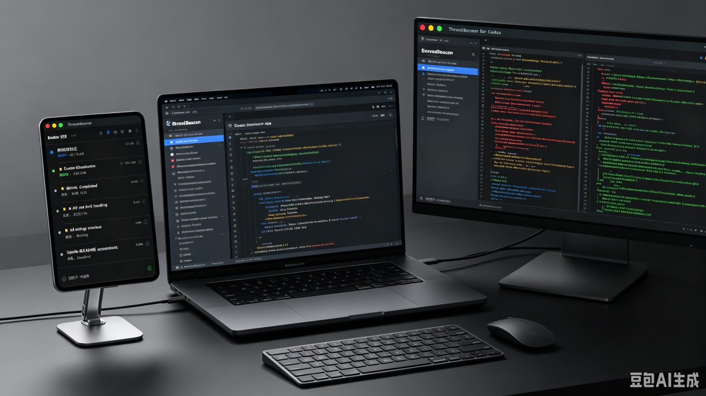
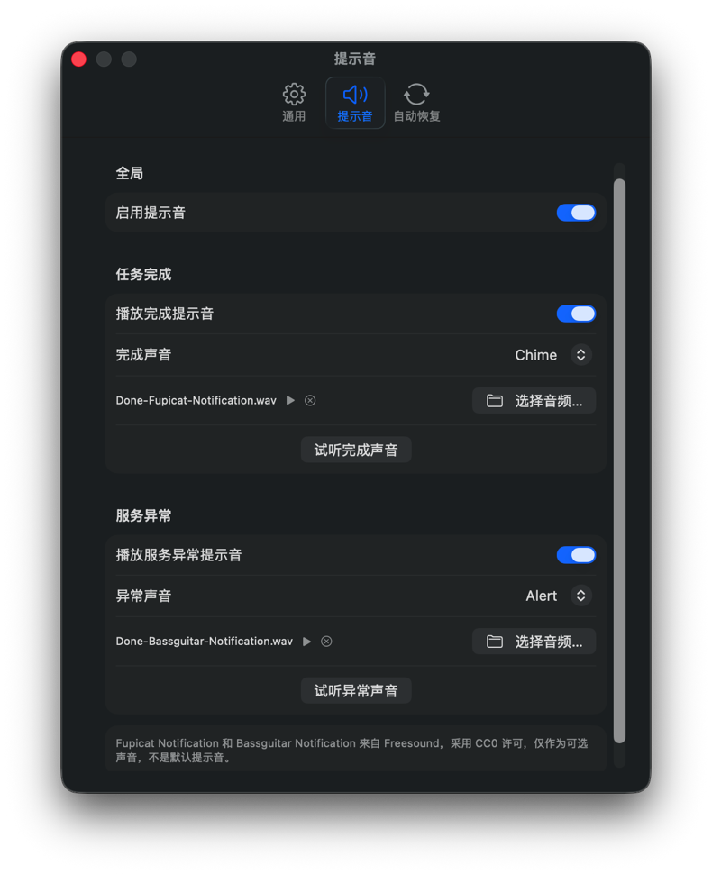
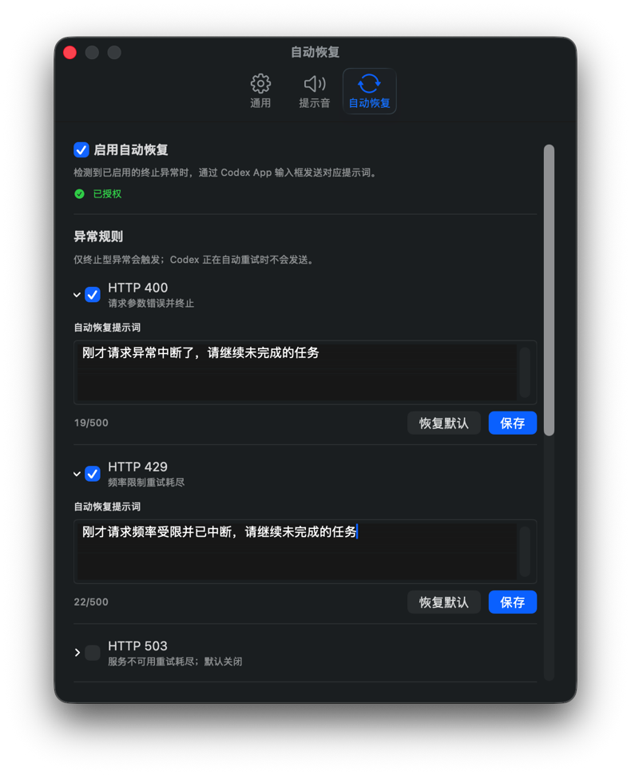

# ThreadBeacon for Codex

简体中文 | [English](README-EN.md)

[](https://github.com/ExDevilLee/codex-threadbeacon-macos/releases)

[](LICENSE)

ThreadBeacon 是一个原生 macOS 小窗口，用于集中查看 Codex Desktop 与 Codex CLI 主任务的
运行、完成、中断和异常状态。它让同时执行多个任务时不必反复切回 Codex，也适合置顶在桌面
或单独放在竖向小屏上。

本项目是非官方社区工具，与 OpenAI 无隶属或背书关系。`Codex` 是其相应权利人的商标。

## 小屏状态台

ThreadBeacon 的紧凑列表适合放在 7 英寸等竖向扩展屏上：MacBook 保留 Codex 交互，主显示器
查看代码和 Diff，小屏持续展示各任务状态。



> AI 生成的使用场景概念图，屏幕内容仅用于表达布局与工作流；实际界面以下方截图为准。

## 30 秒快速开始

使用前请确认：

- macOS 14 或更高版本，支持 Apple Silicon 与 Intel Mac。
- 已安装 Codex Desktop 或 Codex CLI，并且至少运行过一个任务。
- 当前下载包是 ad-hoc 签名、尚未公证的技术预览版。

安装并启动：

```bash
brew install --cask ExDevilLee/tap/threadbeacon
```

ThreadBeacon 启动后会自动读取本机最近的 Codex 主任务，无需填写账号、API Token 或数据路径。
首次启动若被 macOS 阻止，请点击“完成”而不是“移到废纸篓”，然后在 Finder 的“应用程序”中
按住 Control 点击 `ThreadBeacon.app` 并选择“打开”。完整步骤见
[`故障排查`](docs/troubleshooting.md#macos-阻止打开-app)。

## 界面预览

| 主任务状态概览 | Subagent 行内展开 |
| :---: | :---: |
|  |  |

| Token 使用详情 | 通用 Settings |
| :---: | :---: |
|  |  |

| 提示音与自定义音频 | 自动恢复规则与成功记录 |
| :---: | :---: |
|  |  |

## 核心功能

### 一眼查看任务状态

- 默认每 2 秒刷新，可配置为 `1 / 2 / 5 / 10 秒`，也可暂停监听或手动刷新。
- 显示 Codex rename 后的任务名称、状态持续时间和运行任务数。
- 识别运行中、刚完成、已中断、服务异常与未知状态；色盲安全图标默认开启。Token 详情显示
  累计压缩次数；实时`压缩中`需要用户在 Settings 主动安装 Codex Hook。
- “刚完成”保留时间可设置为 `1～5 分钟`，状态优先级始终高于手工置顶。
- 窗口可钉在最前面，并记住显示器、位置和尺寸。

### Subagent 与 Token 概览

- 主任务显示直接 Subagent 的`活跃数/总数`，例如`2/27`，点击后可行内展开。
- 展开行显示 Agent 别名、任务名、状态、最近活动、模型、推理强度和 Token。
- 主列表紧凑显示累计 Token；info 详情展示输入、缓存输入、输出、Reasoning、当前 turn、
  缓存率、模型和推理强度。
- Token 详情不读取或显示会话正文，也不聚合第二层及更深 Subagent。
- 压缩历史、Hook 安装与隐私边界见
  [`压缩状态可观测性设计`](docs/compaction-observability-design.md)。

### 异常监控与提示音

- 从本机白名单结构化日志识别 HTTP 4xx/5xx 重试与终止失败、重新连接重试耗尽，以及明确的
  模型容量异常。
- 活跃重试显示黄色警告，终止失败显示红色错误；异常不会被通用完成事件错误覆盖。
- 完成和异常使用不同的默认提示音，也可分别关闭、试听八种内置声音或选择本地音频。
- 内置与第三方声音的来源和许可见 [`THIRD_PARTY_NOTICES.md`](THIRD_PARTY_NOTICES.md)。
- 详细状态规则和数据边界见
  [`服务异常监控`](docs/service-incident-monitoring.md)。

### 可选的自动恢复

- 自动恢复默认关闭，可分别配置 HTTP 400、HTTP 429、HTTP 503、其他 HTTP 错误、模型容量
  异常和连接中断的开关与提示词；HTTP 503 默认关闭。
- 发送必须由用户明确授予 macOS Accessibility 权限，并通过可见的 Codex App 输入框完成；
  未授权时只做只读监控，不使用外部 CLI 隐式恢复。
- 每类异常默认连续尝试 `3` 次，可设置 `1～20` 次或关闭熔断限制；正常完成会清零计数，
  Settings 也可解除指定任务的熔断。
- 恢复记录保存在本机，可查看未发送、发送中、已发送、发送失败和已熔断结果。

### 日常管理与设置

- 支持收藏、仅显示收藏、置顶、临时忽略和恢复；收藏的归档任务仍可查看并明确标记已归档。
- 双击未归档主任务可在 Codex App 中打开对应任务，需要 Accessibility 权限并执行身份与草稿检查。
- Settings 支持跟随系统、简体中文和 English，以及 System、Light 和 Dark 主题。
- 可配置最大显示任务数、刷新间隔、完成状态保留时间、提示音、自动恢复和登录时启动。
- 底部健康入口展示 SQLite、Rename、Rollout 和服务日志数据源状态。
- App 会检查 GitHub Releases；发现新版本时显示入口，但不会自动下载或安装。

## 下载与安装

### Homebrew Cask

```bash
brew install --cask ExDevilLee/tap/threadbeacon
```

升级到 Tap 中的最新版本：

```bash
brew update
brew upgrade --cask threadbeacon
```

普通卸载保留用户设置；需要一并清理偏好和自动恢复日志时使用：

```bash
brew uninstall --zap --cask threadbeacon
```

Cask 源码与 CI 位于
[`ExDevilLee/homebrew-tap`](https://github.com/ExDevilLee/homebrew-tap)。Homebrew 负责下载、
校验和安装，但不会绕过 Gatekeeper。

### GitHub Release

从 [GitHub Releases](https://github.com/ExDevilLee/codex-threadbeacon-macos/releases) 下载：

```text
ThreadBeacon-vX.Y.Z-macos-universal.zip
ThreadBeacon-vX.Y.Z-macos-universal.zip.sha256
```

将两个文件放在同一目录后可校验完整性：

```bash
shasum -a 256 -c ThreadBeacon-vX.Y.Z-macos-universal.zip.sha256
```

解压并将 `ThreadBeacon.app` 移入 `/Applications`。当前版本尚未使用 Developer ID Application
签名和 Apple 公证，首次打开方法与 Homebrew 安装相同。不要关闭系统级安全保护。

## 数据与隐私

- App 只在本机读取 `~/.codex` 中的任务 SQLite、rename 索引、rollout 尾部和三个白名单日志
  target，用于生成状态、Token、模型和异常信息。
- App 不读取 reasoning summary、会话正文、完整请求、供应商 URL 或 request ID，不上传 Codex
  数据，也不启动网络服务。
- 自动恢复总开关默认关闭；只有用户主动授权 Accessibility 并启用相应规则后，App 才会控制
  Codex App 输入框。
- App 不直接修改 Codex SQLite。当前公开界面也不提供实验性的归档恢复入口。
- 实时压缩状态为可选能力；只有用户主动启用时才会以结构化方式修改本机 Codex Hook 配置，
  保留其他 Hook，并支持从 Settings 卸载还原。
- 更新检查只请求公开 GitHub Release 元数据，不包含 Codex 数据、本机路径、设置或设备标识。
- 本地保存的数据范围、自动恢复日志和权限说明见 [`PRIVACY.md`](PRIVACY.md)。

## 已知限制

- 长时间没有新 rollout 事件的未闭合任务可能暂时显示为`未知`，即使工具调用仍在执行。
- 当前无法通过只读数据源可靠区分等待授权和等待用户输入，不会从静默或会话正文猜测状态。
- Codex 的 SQLite、session index、rollout 和日志格式不是稳定公开 API，Codex 升级后可能需要适配。
- 当前技术预览版尚未公证；登录时启动依赖稳定签名的 App bundle，因此暂不承诺可用。

更多解释和处理方式见 [`故障排查`](docs/troubleshooting.md)。

## 开发与反馈

本地构建：

```bash
./script/test.sh
./script/build_and_run.sh --verify
```

- 版本变更：[`CHANGELOG.md`](CHANGELOG.md)
- 后续候选：[`ROADMAP.md`](ROADMAP.md)
- 参与开发：[`CONTRIBUTING.md`](CONTRIBUTING.md)
- 普通问题：使用 GitHub Issue Forms，请勿上传任务标题、会话内容、数据库或本机路径。
- 安全问题：见 [`SECURITY.md`](SECURITY.md)。

## App 图标


图标采用 `B1 Graphite / Code Beacon`：石墨黑圆角底板、白色代码括号和纵向红黄绿三灯。

## 平台仓库

- macOS：[`ExDevilLee/codex-threadbeacon-macos`](https://github.com/ExDevilLee/codex-threadbeacon-macos)
- Windows：[`ExDevilLee/codex-threadbeacon-windows`](https://github.com/ExDevilLee/codex-threadbeacon-windows)

两个平台使用独立仓库、独立实现和独立发布流程；共享状态语义、功能契约和测试场景，不建立源码依赖。
