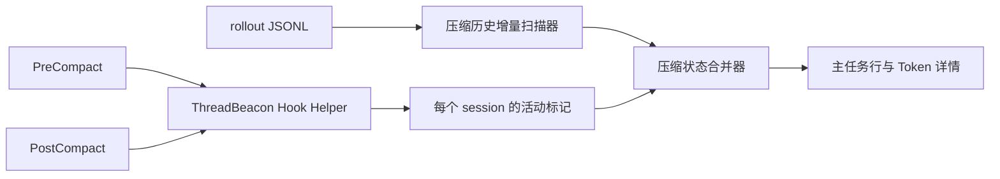

# 压缩状态可观测性设计

## 状态

- 设计日期：2026-07-22
- 设计状态：代码、自动化和隔离 Hook POC 已完成；真实手工与自动压缩仍待持续复验
- 目标版本：压缩状态 MVP
- 实现提交：`5ca29ff`、`3992486`、`a7d8f64`、`252523f`、`50a6d7e`

## 背景与目标

Codex 长任务可能在执行过程中压缩上下文。ThreadBeacon 当前可以从 rollout 判断压缩已经
完成，但无法通过默认的只读轮询可靠判断任务是否正在压缩。

本功能采用混合数据源：所有用户默认获得只读的历史压缩统计；主动启用 Hook 的用户额外获得
实时“压缩中”状态。首版目标如下：

- Token 详情显示当前任务累计完成的压缩次数和最近完成时间。
- 用户主动启用 Hook 后，主任务行显示`压缩中 / Compacting`及已持续时间。
- 压缩状态与 ThreadBeacon 现有两秒刷新、暂停和恢复监听行为保持一致。
- 不显示虚假的百分比、预计剩余时间或 Token 阈值推测。
- 不保存或展示压缩摘要、提示词、Reasoning、工作目录和 transcript。

## 已确认的数据契约

当前 Codex Hook 文档明确支持 `PreCompact` 和 `PostCompact`：

- 两个事件均提供 `session_id`、`turn_id`、`trigger` 和公共字段。
- `trigger` 的取值为 `manual` 或 `auto`。
- Hook 从标准输入接收 JSON；退出码 `0` 且无输出表示成功并继续执行。
- 非托管 Hook 首次安装或定义变更后必须由用户审核信任。
- 用户级 Hook 可由 Codex App 和 Codex CLI 共用，不依赖单个项目目录。

ThreadBeacon 使用 `session_id` 直接关联主任务，不使用标题、列表位置或 rollout 路径猜测。
Hook 对 Subagent 压缩没有提供可供本功能稳定使用的独立 Agent ID，因此首版只在所属主任务
层级显示压缩阶段。

官方依据：

- [Codex Hooks](https://learn.chatgpt.com/docs/hooks)
- [Codex 配置参考](https://learn.chatgpt.com/docs/config-file/config-reference)

## 方案比较

### 方案 A：Settings 引导式自动安装

ThreadBeacon 安装独立 Hook Helper，并在用户明确确认后备份、合并
`~/.codex/hooks.json`。

优点：覆盖 Codex App 与 CLI，用户操作少，可检测、修复和卸载自己的配置。

缺点：需要修改用户配置，并依赖 Codex Hook 信任流程。

### 方案 B：仅提供手工配置

ThreadBeacon 只展示配置片段和操作文档，不修改文件。

优点：应用没有配置写入权限。

缺点：使用门槛高，容易复制错误，后续升级和卸载缺乏可靠管理。

### 方案 C：Codex Plugin

将 Hook 与 Helper 打包为 Codex Plugin。

优点：适合未来发布一组 Codex 扩展能力。

缺点：为单一状态信号引入额外安装、启用和兼容层，超出当前 MVP。

### 决策

采用方案 A。方案 B 只作为无法安全自动合并时的回退说明；方案 C 保留为未来跨平台扩展
候选。

## 总体架构



架构分为三个边界清晰的组件：

1. 压缩历史扫描器只负责从 rollout 统计完成次数和最近完成时间。
2. Hook Helper 只负责将生命周期事件转换为最小活动标记。
3. 状态合并器负责 TTL、完成证据、状态优先级和最终展示模型。

实时 Hook 不参与历史计数。未启用 Hook、Hook 未获信任或 Helper 暂时失败时，历史统计仍可
独立工作。

## Settings 与授权披露

在“通用”设置中新增“实时压缩状态”区域。设置页面必须持续显示以下信息，不能只藏在二次
弹窗中：

- 未启用 Hook 也可以查看累计压缩次数。
- 启用操作会修改 `~/.codex/hooks.json`，注册 `PreCompact` 和 `PostCompact`。
- 修改前会备份原配置，停用时只删除 ThreadBeacon 自己的条目。
- Codex 首次使用或 Hook 定义发生变化后，需要用户审核信任。
- Hook 不读取或保存会话正文、摘要、Reasoning、工作目录和 transcript。

第一版状态包括：

- `未启用`
- `已配置，信任状态请在 Codex 查看`
- `配置已被外部修改`
- `安装失败`

主要操作包括：

- `启用实时压缩状态`
- `检查配置`
- `停用`

ThreadBeacon 不调用 `--dangerously-bypass-hook-trust`，也不把“配置已写入”显示成“已启用”。
Codex 当前没有供 ThreadBeacon 查询实际 trust 状态的公开接口，因此设置页只确认本地配置与
Helper 是否完整，并给出 Codex Hooks 设置和 CLI `/hooks` 的明确检查步骤。

## Hook 配置管理

### 安装

配置管理器使用结构化 JSON API 读写，不通过字符串拼接修改配置：

1. 检查目标文件是否存在、是否为普通文件以及权限是否允许安全修改。
2. 解析现有 JSON，保留所有已有顶层字段、事件组和处理器。
3. 在应用支持目录中创建权限为 `0600` 的最近备份。
4. 计算原文件摘要并构造合并结果。
5. 写入同目录临时文件，设置合理权限并重新验证 JSON。
6. 替换前重新读取原文件；摘要变化时停止，避免覆盖并发修改。
7. 通过原子替换完成安装；失败时保留原配置和备份。

如果 `hooks.json` 不存在，创建包含两个 Hook 的最小合法配置。

### 拒绝自动修改的情况

以下情况停止自动安装并显示具体原因与手工说明：

- `hooks.json` 不是合法 JSON。
- 目标是符号链接或非普通文件。
- 文件权限不允许安全备份或原子替换。
- 安装过程中检测到其他程序修改配置。
- `config.toml` 已存在内联 `[hooks]` 配置。

最后一种情况是为了避免同一配置层同时使用 `hooks.json` 和内联 Hook，触发 Codex 的合并
警告。首版不自动改写 TOML。

### 卸载

卸载按 Helper 的准确命令和事件类型识别 ThreadBeacon 处理器：

- 只删除 ThreadBeacon 注册的 `PreCompact` 和 `PostCompact` 处理器。
- 同一 matcher 组中的其他处理器继续保留。
- 删除后为空的 ThreadBeacon 专属组可以移除。
- 不自动用旧备份覆盖当前配置，避免撤销用户安装后的其他改动。

## Hook Helper 与活动标记

Helper 是随 App 提供的独立无界面可执行程序。启用功能时，ThreadBeacon 将当前版本原子安装到
以下稳定路径，Hook 配置不依赖 App 当时所在目录：

```text
~/Library/Application Support/ThreadBeacon/hooks/v1/ThreadBeaconHookBridge
```

Helper 只从标准输入读取当前 Hook JSON，并保留以下字段：

```json
{
  "schemaVersion": 1,
  "sessionID": "session UUID",
  "turnID": "turn UUID",
  "trigger": "manual",
  "startedAt": "ISO-8601 timestamp"
}
```

活动标记目录为：

```text
~/Library/Application Support/ThreadBeacon/compaction/v1/active/<session-id>.json
```

行为如下：

- `PreCompact` 通过临时文件和原子替换写入当前 session 的标记。
- `PostCompact` 只在 `sessionID + turnID` 与现有标记一致时删除。
- `startedAt` 由 Helper 在收到 `PreCompact` 时使用本机当前时间生成，Hook 输入不提供事件时间。
- 不同 session 使用不同文件，允许多任务并发压缩。
- Helper 使用短超时，不启动 ThreadBeacon UI，不输出模型可见内容。
- Helper 自身失败不能阻断 Codex 压缩；失败只写入最小本地诊断状态。

停用功能时同时删除 ThreadBeacon Hook 条目、活动标记和已安装的 Helper。直接卸载 App 无法安全
修改用户现有 JSON，因此 README 与卸载说明需要提示用户先在 Settings 停用实时压缩状态；遗留
Helper 不读取数据或启动进程，但遗留 Hook 会在压缩时尝试调用它。

## 过期与异常清理

活动标记满足任一条件时立即从 UI 忽略，并在可写时清理：

- `startedAt` 距当前时间超过 15 分钟。
- rollout 出现不早于 `startedAt` 的压缩完成事件。
- 同一任务出现更新的完成或中断证据。
- session ID、turn ID、时间或 schema 无效。
- `startedAt` 明显来自未来。

TTL 是崩溃兜底，不是压缩耗时估计。UI 不根据 TTL 展示进度，也不把接近 TTL 解释为即将
完成。

## 历史压缩统计

新增 rollout 增量扫描器，输出：

- `completionCount`
- `lastCompletedAt`
- 当前读取偏移及文件身份信息

首次显示任务时流式扫描其 rollout，之后每次刷新只处理追加内容。文件被截断、替换或身份
变化时重新扫描。

扫描器同时识别顶层 `compacted` 和 `event_msg.context_compacted`。当前样本中两者通常在数
毫秒内成对出现，扫描器必须合并为一次完成记录；旧格式中只有一种事件时仍计为一次。解析器只
提取事件类型、时间和必要的去重信息，不保留压缩摘要。

## 状态模型与优先级

压缩不是新的错误级状态，而是任务活动阶段：

```text
基础状态：running
活动阶段：compacting
```

最终显示规则：

- 主任务行显示`压缩中 · 已持续 n 秒`或`Compacting · n seconds`。
- 使用运行中的蓝色状态灯和不确定动画。
- 排序优先级与`运行中`相同。
- `错误`、`需要操作`和`服务异常`优先于`压缩中`。
- 已归档任务不显示实时压缩阶段。
- Hook 标记有效但基础状态暂时滞后时，按运行中阶段排序。
- 不显示百分比、预计剩余时间或历史平均耗时。

Token 详情新增：

```text
压缩次数    3
最近压缩    14:32:08
```

没有压缩记录时显示 `0` 和 `—`。

## 暂停监听行为

ThreadBeacon 暂停监听后，不读取新的 Hook 标记或 rollout 内容，界面保持暂停时的快照。恢复
监听后立即执行一次完整刷新，并应用 TTL 与完成证据清理。Hook Helper 是否继续写入标记不受
ThreadBeacon 暂停影响。

## 隐私与安全边界

- 默认历史统计继续使用本机只读 rollout 数据。
- Hook Helper 不保存输入 JSON 中的 `cwd`、`model`、`transcript_path` 或其他未列入白名单
  的字段。
- ThreadBeacon 不展示压缩摘要或 transcript 内容。
- 配置备份可能包含用户已有 Hook 命令，因此权限固定为 `0600`，不进入仓库、日志或遥测。
- 所有配置修改都由用户在 Settings 主动触发，并明确显示目标文件路径。
- Codex Hook trust 仍由 Codex 自身管理，ThreadBeacon 不绕过或伪造信任状态。

## 测试与验收

### 自动化测试

- rollout 成对事件去重、单事件旧格式、损坏行和跨读取边界。
- 增量追加、文件截断、文件替换和首次扫描。
- Pre/Post 正常顺序、重复事件、并发 session 和 turn 不匹配。
- TTL、完成证据、中断证据、未来时间和损坏标记。
- 状态优先级、运行中排序和已归档任务。
- `hooks.json` 创建、合并、卸载、备份和幂等安装。
- 配置并发修改、非法 JSON、符号链接、权限失败和内联 TOML Hook。
- 中英文文案、暂停与恢复监听。

### 实机验收

1. 在 Settings 中启用实时压缩状态，确认页面提前披露文件修改。
2. 检查原 Hook 配置已备份，已有处理器保持不变。
3. 在 Codex 中审核并信任两个 Hook。
4. 对指定主任务执行手工 `/compact`。
5. 确认 ThreadBeacon 在两秒刷新周期内显示“压缩中”和持续时间。
6. 确认完成后实时状态消失，压缩次数增加且最近完成时间更新。
7. 暂停监听期间触发压缩，恢复监听后确认状态与计数正确收敛。
8. 停用功能，确认只删除 ThreadBeacon 条目，默认历史统计仍可用。

自动压缩只在真实场景出现后补充证据，不通过降低生产阈值伪造结论。

## 非目标与后续候选

本次不实现：

- 压缩百分比或预计剩余时间。
- 根据 Token 用量或静默时间猜测压缩。
- 压缩摘要查看、搜索或持久化。
- Subagent 级压缩定位。
- Codex Plugin 分发。
- Windows 版本同步实现。

macOS MVP 实机验证稳定后，再将状态语义和测试场景同步到 Windows 仓库评估。
