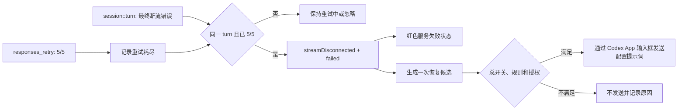

# ThreadBeacon 连接中断自动恢复设计

## 状态

- 设计日期：2026-07-22
- 真实样本：一个 Codex 主任务在第 5 次重新连接后终止
- 采用方案：等待同一 turn 的最终断流错误，再触发自动恢复
- 默认边界：自动恢复总开关仍默认关闭

## 问题与证据

真实样本的结构化日志顺序为：

1. `codex_core::responses_retry` 记录 `retrying sampling request (5/5 ...)`。
2. 约 7 秒后，同一 turn 的 `codex_core::session::turn` 记录
   `Turn error: stream disconnected before completion: error sending request for url (...)`。

当前 `LogEventRepository` 会读取第一条重试记录，但 `session::turn` 的 SQL 白名单只接受带
HTTP 状态码或模型容量异常的 `Turn error`，因此最终断流记录被过滤。解析器只看到重试进度，
把任务持续保留为黄色 `retrying`；`ThreadStatusStore` 只为 `failed` 事件产生自动恢复候选，
所以不会发送恢复提示。

设计只保留 turn episode ID、重试进度、异常类型和时间，不保存或展示 URL、完整日志正文、
任务标题或请求信息。

## 方案比较

### 方案 A：最终错误确认后恢复

要求同一 turn 已记录 `attempt == limit`，并出现精确的最终断流 `Turn error`。此时将 episode
从黄色 `retrying` 转为红色 `failed`，再进入现有自动恢复策略。

优点是不会和第 5 次重试并发，也不会把一次可恢复的临时断流误判为终止失败。采用此方案。

### 方案 B：看到 5/5 立即恢复

触发更早，但日志中的 `5/5` 表示即将进行最后一次重试，不代表最后一次已经失败。提前发送可能
与 Codex 内部重试同时运行，造成重复 turn 或输入冲突。

### 方案 C：复用 HTTP 503

改动最少，但真实日志没有 HTTP 状态码。映射为 503 会污染状态语义，而且当前 503 自动恢复规则
默认关闭，无法表达用户希望单独开启连接中断恢复的需求。

## 状态模型与判定

新增 `ServiceIncidentKind.streamDisconnected`，不设置 `httpStatusCode`。

同一 episode 满足以下全部条件时才进入 `failed`：

- `codex_core::responses_retry` 存在有效重试进度；
- `retryAttempt == retryLimit`；
- 后续 `codex_core::session::turn` 包含精确前缀
  `Turn error: stream disconnected before completion:`。

在最终错误出现前继续保持现有黄色 `warning` 和 `重试 n/limit`。最终错误出现后显示红色
`error`，主任务状态详情显示“连接中断”，并保留 `重试 5/5`。如果同一 turn 后续出现明确成功，
沿用现有 episode 清理规则，不保留过期异常。

Repository 只新增上述精确 `Turn error` 形态，不放宽到所有 `session::turn` 日志，也不读取
`codex_http_client::transport`。

## 自动恢复设置

新增 `AutoRecoveryIncidentType.streamDisconnected`：

- 中文名称：`连接中断`
- 中文说明：`重新连接重试耗尽后终止`
- 英文名称：`Connection interrupted`
- 英文说明：`Stopped after reconnection retries were exhausted`
- 默认启用状态：`true`
- 中文默认提示词：`刚才连接中断且重试失败，请继续未完成的任务`
- 英文默认提示词：
  `The connection was interrupted and all retries failed. Please continue the unfinished task.`

“默认启用”只表示用户开启自动恢复总开关后该规则可以参与；不会改变总开关默认关闭、
Accessibility 必须由用户授权、历史异常启动时不补发、同一 episode 只处理一次等现有边界。

现有设置载荷缺少新规则时，由 `normalizeRules` 自动补入默认值。版本号保持当前值，因为解码逻辑
本来就支持用默认规则补齐新增枚举项，且不会覆盖其他类型的自定义提示词或开关。

## 数据流

## 测试与验收

自动测试覆盖：

- Parser 在只有 `5/5` 时仍返回 `retrying`。
- Parser 在同 turn 出现 `5/5` 和最终断流错误时返回 `failed` 与
  `streamDisconnected`。
- 没有 `5/5` 的断流文本不触发终止恢复。
- Repository 能读取精确最终断流日志，但仍排除 transport 与其他非白名单正文。
- 新异常类型映射到独立自动恢复规则，默认提示词支持简体中文和英文。
- 旧设置缺失新规则时自动补齐，不改变已有自定义规则。
- `ThreadStatusStore` 只为最终断流产生一次恢复候选，活跃重试不产生候选。

UI 验收覆盖：

- 活跃重试显示黄色“服务异常 ｜ 重试 n/limit”。
- 最终断流显示红色“服务失败 ｜ 连接中断 ｜ 重试 5/5”。
- Settings 的自动恢复列表可编辑、关闭和恢复该类型的默认提示词。
- 简体中文、英文、浅色和深色主题下文案不裁切。

## 不在本次范围

- 不从截图、会话正文或非白名单日志猜测网络状态。
- 不在仅看到 `5/5` 时提前发送恢复提示。
- 不解析、保存或显示供应商 URL、域名和完整错误正文。
- 不改变 HTTP 400、429、503、其他 HTTP 错误和模型容量规则的默认行为。
- 不绕过自动恢复总开关、Accessibility 授权和输入框安全预检。
